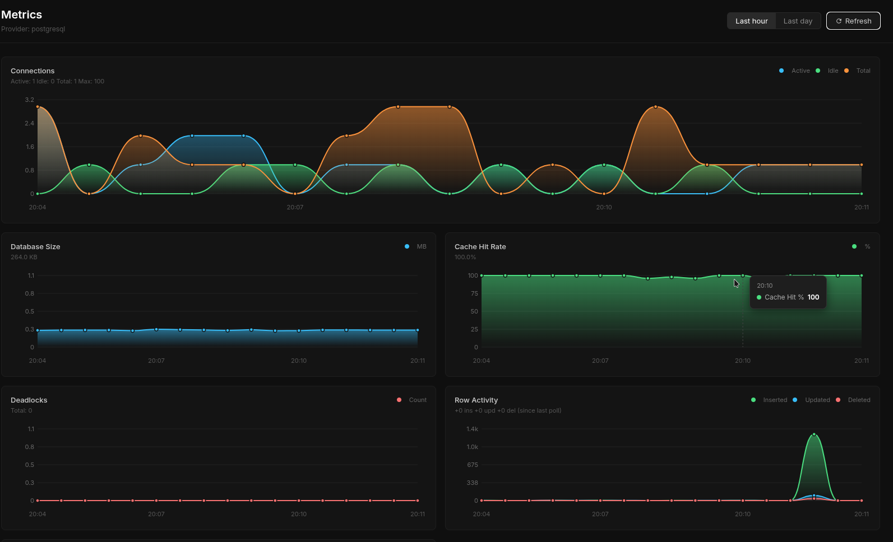
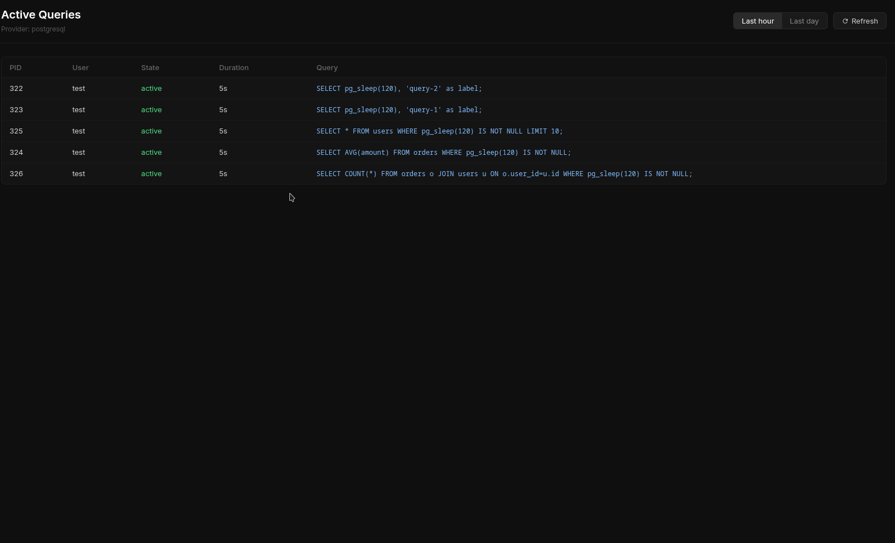
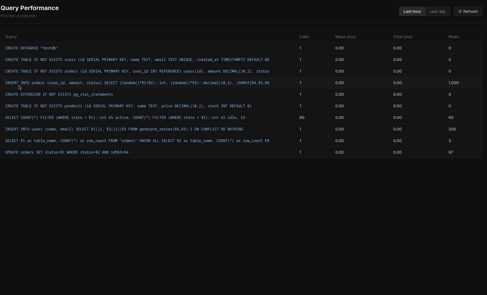

# Database Metrics

FlashORM Studio includes a built-in **Metrics** dashboard that gives you real-time visibility into your database's health, performance, and activity — without any external monitoring tools.



## Accessing Metrics

Click the **chart icon** in the left navbar of FlashORM Studio, or navigate directly to `/metrics`.

```bash
flash studio
# then open http://localhost:PORT/metrics
```

## Database Support

| Metric | PostgreSQL | MySQL | SQLite |
|--------|-----------|-------|--------|
| Connections | ✅ | ✅ | ✅ (always 1) |
| Database Size | ✅ | ✅ | ✅ |
| Cache Hit Rate | ✅ | ✅ | ❌ |
| Deadlocks | ✅ | ❌ | ❌ |
| Row Activity | ✅ | ✅ | ❌ |
| Active Queries | ✅ | ✅ | ❌ |
| Query Performance | ✅ requires `pg_stat_statements` | ✅ requires `performance_schema` | ❌ |
| Table Sizes | ✅ | ✅ | ✅ |

::: tip Cloud databases (Neon, PlanetScale, etc.)
FlashORM automatically falls back to available system views when certain tables are restricted. On Neon for example, `pg_statio_user_tables` is used instead of `pg_stat_database`.
:::

## Metrics Tab

The main dashboard shows **time-series area charts** that auto-refresh every 30 seconds. On first load, charts are seeded with slight variation around the current values so lines are immediately visible.

### Connections

Tracks how many database connections are open:

- **Active** — connections currently executing a query
- **Idle** — connections open but waiting
- **Total** — all open connections
- **Max** — configured connection limit (`max_connections`)

High active connections close to max means your connection pool may be saturated.

### Database Size

Total disk space used by all tables and indexes, shown in B / KB / MB / GB.

### Cache Hit Rate

Percentage of data reads served from memory vs. disk:

- **> 90%** — healthy
- **< 80%** — consider increasing `shared_buffers` (PostgreSQL) or `innodb_buffer_pool_size` (MySQL)

### Deadlocks

Count of deadlock events since the last stats reset.

A **deadlock** happens when two transactions are each waiting for a lock the other holds. PostgreSQL auto-detects and resolves them by cancelling one transaction.

```
Transaction A: locks row 1, waiting for row 2
Transaction B: locks row 2, waiting for row 1
→ Deadlock — PostgreSQL cancels one transaction
```

A non-zero deadlock count in production usually indicates a concurrency bug — transactions updating the same rows in inconsistent order.

### Row Activity

Shows **inserts, updates, and deletes per poll interval** (delta, not cumulative totals), so you can see write activity spikes in real time.

- Spike in inserts → bulk import or high write traffic
- Spike in deletes → cleanup job or bulk removal  
- High updates → frequent record modifications

## Active Queries



Shows all queries **currently executing** on the database:

| Column | Description |
|--------|-------------|
| PID | Process ID — use to kill a stuck query |
| User | Database user running the query |
| State | `active` = running, `idle in transaction` = waiting |
| Duration | How long it has been running |
| Query | SQL being executed (truncated to 120 chars) |

::: warning Long-running queries
On PostgreSQL, kill a stuck query with:
```sql
SELECT pg_terminate_backend(PID);
```
:::

## Query Performance



Shows the **top 10 slowest queries** ranked by mean execution time.

**Requirements:**

- PostgreSQL: `pg_stat_statements` extension
- MySQL: `performance_schema` (enabled by default on MySQL 8+)

**Enabling `pg_stat_statements` on self-hosted / Docker:**

```bash
docker run ... postgres -c shared_preload_libraries=pg_stat_statements
```

Then run once in your database:
```sql
CREATE EXTENSION IF NOT EXISTS pg_stat_statements;
```

**Reading the table:**

| Column | Meaning |
|--------|---------|
| Query | Normalized SQL (`$1`, `$2` replace actual values) |
| Calls | How many times this query ran |
| Mean (ms) | Average execution time — **sort by this to find bottlenecks** |
| Total (ms) | Total cumulative time |
| Rows | Average rows returned/affected |

A query with **high calls + high mean ms** is your top optimization target.

## System Operations

Shows all tables with their disk size and row counts — useful for spotting which tables are growing fastest.

## Time Range & Refresh

- **Last hour / Last day** — clears the in-browser history and starts fresh accumulation
- **Refresh** — forces an immediate data fetch
- **Auto-refresh** — runs every 30 seconds automatically

::: info No persistent storage
Charts are built from data accumulated during your current browser session (up to 30 data points). FlashORM does not store historical metrics. For long-term monitoring, integrate with Prometheus + Grafana.
:::
